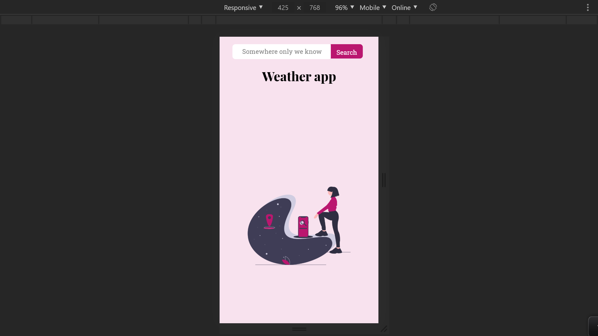
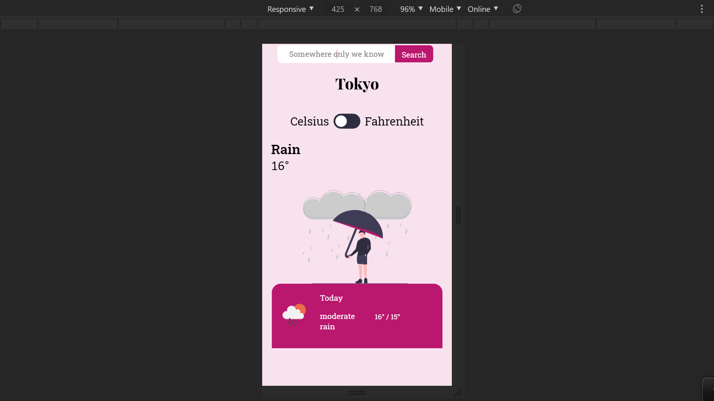
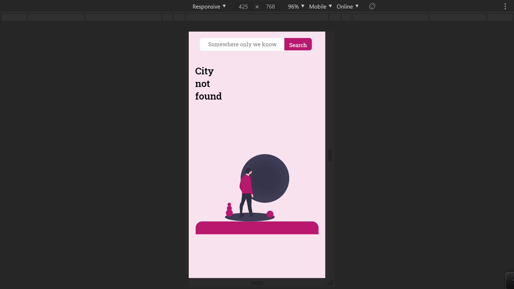

# ⛈️ WeatherApp - Javascript

## Preview

### HomePage

### Main

### Error

This project is part of a series of projects to be completed by students of [Microverse](https://www.microverse.org/).

This project focuses on creating a WeatherApp.

## 🧮 The Project Brief

The specifications and the guide to the project can be found The Odin Project's ['WeatherApp'](https://www.theodinproject.com/courses/javascript/lessons/weather-app) page.

The premise of this project is to use webpack and only JS modules to create a Weather app. Here the user will be able to search for a city and toggle between celsius or fahrenheit as the weather unit.

## 🧬 Technologies & Languages Used

- Javascript
- ESLint
- StyleLint
- CSS/SASS
- Stickler CI
- Webpack
- Promises
- OpenWeatherAPI

## 🔰 Setup & Usage

## 🛎️ Contributions, Issues & Forking

If you have any issues setting up the project or you come across any unintended bugs or problems, please do submit an issue to the [Weather app](https://github.com/Psiale/weather-app/issues) page.

If you want to make your own changes, modifications or improvements to our project, go ahead and Fork it!
1. [Fork it](https://github.com/Psiale/weather-app/fork)
2. Create your working branch (git checkout -b [choose-a-name])
3. Commit your changes (git commit -am 'what this commit will fix/add/improve')
4. Push to the branch (git push origin [chosen-name])
5. Create a new Pull Request

## 🤟🏽😄 😛🤙🏾  Creator

Alexis Sanchez - [Github](https://github.com/Psiale)

## 🙌🏾 Show Your Support

Give a ⭐️ if you like this project!

